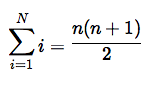

# latexpp

*latexpp* is a first-of-its kind C++ library for generating `LaTeX` equations via C++. It supports conversion of `LaTeX` equations to HTML as well as JPG, PNG and SVG image formats.

## Usage

```C++
#include "latex.hpp"

int main(int argc, const char* argv[])
{
	// Single class
	Latex latex;

	const std::string equation = "\\sum_{i=1}^{N} i = \\frac{n(n + 1)}{2}";

	// Convert to PNG, store in 'equation.png'
	latex.to_png(equation, "equation.png");

	// Convert to HTML, returns a HTML snippet
	std::string html = latex.to_html(equation);
}
```

`equation.png`:



## Documentation

You can build extensive documentation with `doxygen`. See the `doxyfile` in the `docs/` folder. There are also some example programs in the `examples` folder.

## Authors

Peter Goldsborough + [cat](https://goo.gl/IpUmJn) :heart:

<a href="http://img.shields.io/gratipay/goldsborough.png?style=flat-square" target="https://gratipay.com/~goldsborough/">
